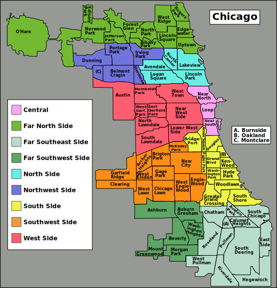

# Chicago Transit Analysis 
This project is an interactive dashboard using American Community Survey (ACS) data to visualize differeneces in areas within a halfmile of CTA rail lines in the City ofo Chicago, and areas that are a halfmile outside this buffer. This project builds a lot from the examples and code done in Ken Steif's book [Public Policy Analytics: Code & Context for Data Science in Government](https://urbanspatial.github.io/PublicPolicyAnalytics/) which is a greate resource for geospatial analytics for public sector data science. 

# Importing the Data
## ACS Data
Using the `tidycensus` package, the ACS five year survey ending in 2019 is read in. The following variables are selected:

| **Variable**               | **ACS Code** | **Description**                                  |
|----------------------------|--------------|-------------------------------------------------|
| `race_total_population`    | B02001_001   | Total Population: ACS Five-Year Survey (2019).   |
| `race_white_population`    | B02001_002   | White Population: ACS Five-Year Survey (2019).   |
| `race_black_population`    | B02001_003   | Black Population: ACS Five-Year Survey (2019).   |
| `race_hispanic_population` | B03002_003   | Hispanic/Latine Population: ACS Five-Year Survey (2019). |
| `median_income`            | B19013_001   | Median Household Income: ACS Five-Year Survey (2019). |
| `poverty_population`       | B17001_002   | Population in Poverty: ACS Five-Year Survey (2019). |
| `poverty_total_population` | B17001_001   | Total Population for Poverty Estimate: ACS Five-Year Survey (2019). |
| `median_rent`              | B25064_001   | Median Gross Rent: ACS Five-Year Survey (2019).  |

## CTA Stops
The shapefile for CTA L (Elevated Rail) stops was sourced from the [Chicago Data Portal](https://data.cityofchicago.org/Transportation/CTA-L-Rail-Lines/xbyr-jnvx/about_data) and downloaded in GeoJSON format. Locally, it is stored in the [data](chicago_dashboard/data) directory and can be imported using the [import.R](chicago_dashboard/src/import.R) script. This file contains point geometries representing each CTA L stop, which are used to identify census tracts located within a half-mile radius of these stops. 

## Chicago Community Areas and Broader Regions
Chicago is officially divided into **77 Community Areas**, a system established by the University of Chicago in the 1920s. These Community Areas serve as stable geographic boundaries for analysis, planning, and research. The boundary data used in this project is available on the [Chicago Data Portal](https://data.cityofchicago.org/Facilities-Geographic-Boundaries/Boundaries-Community-Areas-current-/cauq-8yn6).

While there are no *official* broader regions of Chicago, commonly used regional groupings exist. For this project, the "Chicago Sides" shapefile was created to group Community Areas into familiar broader regions (e.g., North Side, South Side, West Side). These groupings were based on the map below, accessed from [Wikimedia Commons](https://commons.wikimedia.org/wiki/File:Chicago_community_areas_map.svg):

### Data Cleaning and Standardization  
After importing all datasets, the following broad cleaning steps were performed in `cleaning.R`:  

- **Coordinate Reference System (CRS) Standardization**:  
  All spatial data were standardized to the **EPSG:3435** coordinate system (NAD83 / Illinois East, ftUS). This projection ensures accuracy when analyzing spatial data within the City of Chicago by minimizing distortion and providing precise local measurements.  

- **Clipping to Chicago Boundaries**:  
  Both the ACS data and the CTA stops shapefile extend beyond Chicago's official boundaries. Using the **sf** package, all datasets were intersected with the Chicago boundary shapefile to retain only data within the city limits.  

- **Constructing the "Chicago Sides" Spatial Object**:  
  In a separate script, [`chicago_sides.R`](chicago_dashboard/src/sides.R), the unofficial "sides" of Chicago were created by grouping Community Areas into broader regions (e.g., North Side, West Side) using the **sf** package and union operations. This custom spatial object enables regional-level analysis and visualization.  

